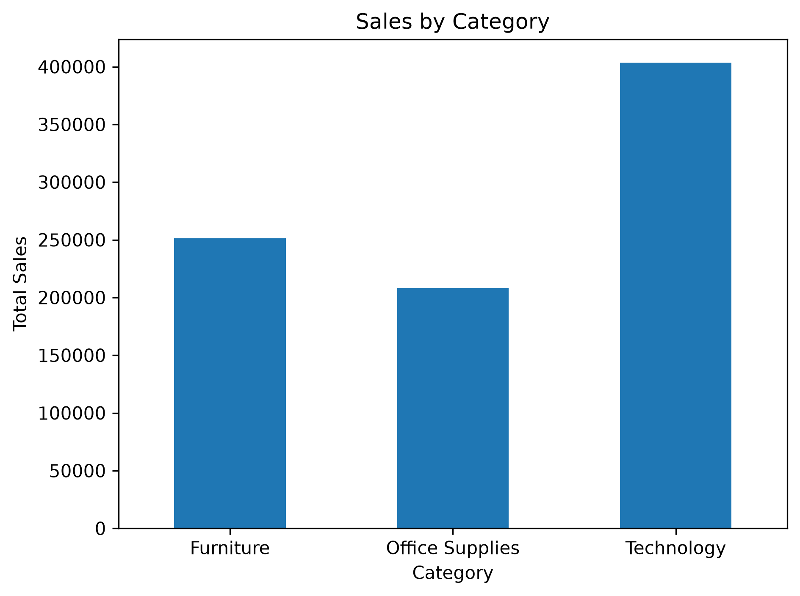

# 📊 Sales Data Analysis

## Project Overview
This project analyzes Superstore sales data using Python to understand sales performance, profitability, and category-wise trends.

## Tools & Technologies
- Python
- Pandas
- Matplotlib
- VS Code

## Analysis Performed
- Explored the dataset structure
- Checked for missing values
- Checked for duplicate records
- Calculated total sales
- Calculated total profit
- Calculated total quantity sold
- Analyzed sales by product category
- Created a category-wise sales visualization

## Key Insights
- Total Profit: 162,628.00
- Total Quantity Sold: 1,964
- Technology generated the highest sales.
- Furniture was the second-highest selling category.
- Office Supplies had the lowest sales among the three categories.

## Sales by Category

## Files
- `analysis.py` - Python analysis code
- `superstore.csv` - Dataset used for analysis
- `sales_by_category.png` - Sales visualization

## Author
Rajveer